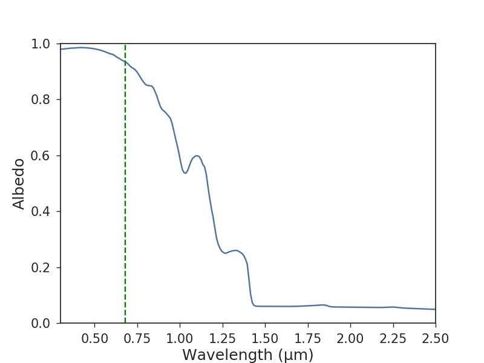
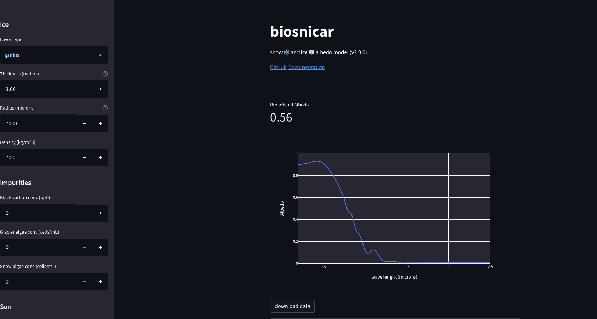

# BioSNICAR




## Introduction

BioSNICAR predicts the spectral albedo of snow and glacier ice between 200nm to 5000nm given information about the illumination conditions, ice structure and the type and concentration of light-absorbing particulates (LAPs) externally mixed with the snow/ice. A detailed description of the theory on which the model is based can be found in Flanner et al. 2021. Briefly, the spectral albedo is computed from the single scattering  properties of snow/ice and the light absorbing particulates (LAPs), along with the concentrations of LAPs and the physical properties of snow/ice (density, grain/pore size). These can vary in each layer, allowing for representation of e.g. porous weathered crust above unweathered ice with an uppermost mm of liquid water containing algae, or deep layers of ancient dust. The jumping-off point for this model was legacy FORTRAN and Matlab code from SNICAR model - Flanner et al. (2007) - which solves the radiative transfer equations after Toon et al. 1989. Two solvers are available: the original SNICAR matrix solver typically representing ice and snow with grains (Toon et al. 1989) and the Adding-Doubling (AD) solver representing the ice as a solid medium with air bubbles and allowing the incorporation of Fresnel reflecting layers (Brieglib and Light, 2007, Dang et al. 2019, Wicker et al. 2022). biosnicar-py couples SNICAR to a bio-optical model that allows for calculation of optical properties of snow and glacier algae to load into the model as LAPs (Cook et al. 2017, 2020), which were later measured empirically and integrated in the model (Chevrollier et al. 2023). This functionality, along with the vectorized AD solver formulation, the possibility to add liquid water into snow and ice matrices, accessible user interface and applicability to a very wide range of surface conditions are the unique selling points of this implementation. This code is also very actively maintained and we welcome contributions from the community to help make BioSNICAR a useful tool for a diverse range of cryosphere scientists. 

NOTE: This code utilizes the miepython solver (Scott Prahl, https://github.com/scottprahl/miepython/tree/main) by default instead of the Bohren and Huffman 1983 solver as per the original Matlab version, hence slight differences exist in the computed albedo. The rationale for using the miepython solver was mostly due to the time efficiency of the computations, so that users can compute new grain/bubble SSPs for a given effective radius if it is not already available in the model (`ssps_spheres_generator.py` in the classic branch). It is however possible to fall back to the BH83 solver by changing the refractive index variant in the ice optical properties configuration (see the OP_DIR_STUBS and related settings in `inputs.yaml`).

## Important notice: repository history rewrite (March 2026)

The git history of this repository was rewritten in March 2026 to remove large binary files that had accumulated across past commits, bringing the download size from ~1GB to ~170 MB. If you cloned the repository before this date your local history will no longer match the remote. To sync up, the simplest fix is to **delete your local clone and re-clone**:

```
rm -rf biosnicar-py
git clone https://github.com/jmcook1186/biosnicar-py.git
```

No source code or data files were lost — only duplicate historical versions of large data files were removed. Existing forks will also need to be re-forked or have their history reset.

## Documentation and recent updates

Detailed documentation is available at https://biosnicar.vercel.app. This README gives a brief overview of the key information required to run the model. See also [docs/EMULATOR.md](docs/EMULATOR.md) and [docs/INVERSION.md](docs/INVERSION.md) for the emulator and inversion modules, and the [examples/](examples/) directory for worked examples.


## How to use

There are two ways to run the biosnicar model: 1) use the app; 2) run the code. The app is designed to be extremely user-friendly and requires no coding skills. The app simply runs in the browser and is operated with a simple graphical user interface. You can use the deployed version by visiting

[bit.ly/bio-snicar](https://bit.ly/bio-snicar)

Alternatively, you can run the app locally. Power users will prefer to run the code directly to give access to all of BioSNICAR's functions. Both running the code and the app (if running locally) require a Python development environment with specific packages installed. The following section describes how to set up that environment.

### Installing Environment/Dependencies

If you do not have Python installed, download Python >3.8. It is recommended to use a fresh environment using conda or venv. Once activated, install the project dependencies with:

```
pip install -r requirements.txt
```

Now install biosnicar:

```
pip install -e .
```

Finally, if you do not wish to install anything on your computer, but you use VSCode and Docker, then you can use the devcontainer config provided to run this code in a remote container. This requires the "remote containers" extension to be added to VSCode. Further instructions are available here: https://code.visualstudio.com/docs/remote/containers

### Using the App

Instructions for using the app are provided below.

#### Run the app

To run the deployed version of the app simply direct your browser to [bit.ly/bio-snicar](https://bit.ly/bio-snicar). Alternatively, run the app locally by following these instructions:

The code for the Streamlit app is in `~/app.py`.

In a terminal, navigate to the top-level biosnicar directory and run:

`./start_app.sh`

This starts the Streamlit server running on `http://localhost:8501`.




### Get albedo data

Simply update the values and the spectral albedo plot and the broadband albedo value will update on the screen. You can download this data to a csv file by clicking `download data`.

### Running the code

The model driver and all the core source code can be found in `./biosnicar`. From the top-level directory (`~/biosnicar-py`), run:

`python main.py`

This will run the model with all the default settings. The user will see a list of output values printed to the console and a spectral albedo plot appears in a separate window. The code can also be run in an interactive session (Jupyter/iPython) in which case the relevant data and figure will appear in the interactive console.

### Programmatic API — `run_model()`

For programmatic use, `run_model()` is the recommended single entry point. It accepts keyword overrides for any model parameter, runs the full pipeline (setup → optical properties → impurity mixing → radiative transfer), and returns an `Outputs` object:

```python
from biosnicar.drivers.run_model import run_model

# Run with default inputs
outputs = run_model()
print(outputs.BBA)

# Override specific parameters
outputs = run_model(solzen=50, rds=1000, black_carbon=500)
print(outputs.albedo)  # 480-element spectral albedo
```

Supported override keys: `solzen`, `direct`, `incoming`, `rds`, `rho`, `dz`, `lwc`, `layer_type`, `shp`, `grain_ar`, `cdom`, `water`, `hex_side`, `hex_length`, `shp_fctr`, and impurity names (`black_carbon`, `snow_algae`, `glacier_algae` — matching the YAML keys in `inputs.yaml`). Scalar values for ice parameters are broadcast to all layers; scalar impurity concentrations are applied to the first layer only.

If a list override changes the number of layers (e.g. passing a 5-element `dz` when the default config has 2), all per-layer attributes are automatically resized. Ice properties (`rds`, `rho`, `grain_ar`, etc.) are extended by repeating their last value; impurity concentrations are zero-padded. This means you only need to specify the parameters you care about — the rest adjust to match.

`run_model()` is also accessible as `biosnicar.run_model()` after `import biosnicar`.

Parameters not exposed as `run_model()` overrides — such as refractive index variant (`OP_DIR_STUBS`), surface reflectance file (`SFC`), and RT approximation type (`APRX_TYP`) — can be changed by editing `biosnicar/inputs.yaml` directly or by passing a custom YAML path via `input_file=`. See the in-line annotations in `inputs.yaml` for guidance on valid values.

### Working with Impurities

Impurity concentrations are set using descriptive names that map directly to entries in `biosnicar/inputs.yaml`:

| Name            | YAML key        | Unit     | Description   |
| --------------- | --------------- | -------- | ------------- |
| `black_carbon`  | `black_carbon`  | ppb      | Black carbon  |
| `snow_algae`    | `snow_algae`    | cells/mL | Snow algae    |
| `glacier_algae` | `glacier_algae` | cells/mL | Glacier algae |

Use these names everywhere — in `run_model()`, `parameter_sweep()`, emulator building, and inversions:

```python
# run_model — scalar (applied to first layer) or per-layer list
run_model(black_carbon=5000, glacier_algae=50000)
run_model(glacier_algae=[40000, 10000, 0])  # per-layer

# parameter_sweep
parameter_sweep(params={"black_carbon": [0, 1000, 10000]})

# Emulator
Emulator.build(params={"rds": (100, 5000), "black_carbon": (0, 100000)}, ...)

# Inversion
retrieve(observed=obs, parameters=["rds", "black_carbon"], emulator=emu)
```

**Adding a new impurity type:**

1. Obtain an optical property `.npz` file (containing MAC, SSA, asymmetry parameter arrays)
2. Add it to the LAP archive (`data/OP_data/480band/lap.npz`)
3. Add an entry to `inputs.yaml` under `IMPURITIES`:
   ```yaml
   IMPURITIES:
     my_new_impurity:
       FILE: "my_impurity_file.npz"
       COATED: False
       UNIT: 0          # 0 = ppb (mass), 1 = cells/mL (count)
       CONC: [0, 0]     # default concentration per layer
   ```
4. Use the YAML key as the parameter name: `run_model(my_new_impurity=500)`

### Parameter Sweeps

For sensitivity analysis or exploring how albedo responds to changing conditions, the `parameter_sweep` function runs the model over the Cartesian product of any supported input parameters and returns a pandas DataFrame:

```python
from biosnicar.drivers.sweep import parameter_sweep

df = parameter_sweep(
    params={
        "solzen": [30, 40, 50, 60, 70],
        "rds": [100, 200, 500, 1000],
    }
)

# Pivot table of broadband albedo
df.pivot_table(values="BBA", index="solzen", columns="rds").plot()
```

Supported parameter keys include `solzen`, `direct`, `incoming`, `rds`, `rho`, `dz`, `layer_type`, and impurity names (`black_carbon`, `snow_algae`, `glacier_algae`). The function also accepts `solver` (`"adding-doubling"` or `"toon"`), `return_spectral=True` to include 480-band spectral albedo in the output, and `progress=True` for a tqdm progress bar.

A complete demo script is provided at `scripts/sweep_demo.py`:

```
python scripts/sweep_demo.py
```

More complex applications — including model inversions, emulator-based retrieval, and multi-platform band convolution — are demonstrated in the [examples/](examples/) directory.

### Platform Band Convolution — `.to_platform()`

BioSNICAR outputs 480-band spectral albedo, but satellites and climate models use coarser spectral windows. The `.to_platform()` method maps the high-resolution spectrum onto platform-specific bands via SRF convolution (satellites) or flux-weighted interval averaging (GCMs). It chains directly onto `run_model()` and `parameter_sweep()`:

```python
from biosnicar import run_model

# Single run → satellite bands
s2 = run_model(solzen=50, rds=1000).to_platform("sentinel2")
print(s2.B3, s2.NDSI)

# Single run → GCM bands
cesm = run_model(solzen=50).to_platform("cesm2band")
print(cesm.vis, cesm.nir)
```

```python
from biosnicar.drivers.sweep import parameter_sweep

# Parameter sweep → band columns appended to DataFrame
df = parameter_sweep(
    params={"rds": [500, 1000], "solzen": [50, 60]},
).to_platform("sentinel2")

print(df[["rds", "solzen", "BBA", "B3", "NDSI"]])
```

Supported platforms: `sentinel2`, `sentinel3`, `landsat8`, `modis`, `cesm2band`, `cesmrrtmg`, `mar`, `hadcm3`. Detailed documentation including band definitions, data provenance, spectral indices, and instructions for replacing the initial tophat SRFs with manufacturer curves is in [BANDS.md](BANDS.md).

### Emulator — Fast Surrogate Model

The emulator is a neural-network surrogate trained on BioSNICAR forward model outputs. It predicts 480-band spectral albedo in ~microseconds (vs ~50 ms for the full model), making optimisation and MCMC practical.

A pre-built default emulator ships with the repo at `data/emulators/glacier_ice_7_param_default.npz`:

```python
from biosnicar.emulator import Emulator
from biosnicar import run_emulator

# Load and predict
emu = Emulator.load("data/emulators/glacier_ice_7_param_default.npz")
outputs = run_emulator(emu, rds=1000, rho=600,
                       black_carbon=5000, glacier_algae=50000)
print(outputs.BBA)
outputs.to_platform("sentinel2")
```

Build a custom emulator for different parameter ranges, impurity types, or ice configurations:

```python
emu = Emulator.build(
    params={"rds": (100, 5000), "rho": (100, 917),
            "black_carbon": (0, 100000), "glacier_algae": (0, 500000)},
    n_samples=5000, layer_type=1, solzen=50, direct=1,
)
emu.save("my_emulator.npz")
```

`run_emulator()` returns an `Outputs` object with `.to_platform()` chaining, just like `run_model()`. Full documentation: [docs/EMULATOR.md](docs/EMULATOR.md). Examples: [examples/04_emulator_build.py](examples/04_emulator_build.py), [examples/05_emulator_predict.py](examples/05_emulator_predict.py).

### Inversion — Retrieve Ice Properties from Observations

The inverse module retrieves ice physical properties from observed albedo (spectral or satellite bands) using emulator-powered optimisation:

```python
from biosnicar.inverse import retrieve

# Spectral retrieval (480-band observed albedo)
result = retrieve(
    observed=measured_albedo,
    parameters=["rds", "rho", "black_carbon", "glacier_algae"],
    emulator=emu,
)
print(result.summary())
```

```python
import numpy as np

# Satellite band retrieval (e.g. Sentinel-2)
result = retrieve(
    observed=np.array([0.82, 0.78, 0.75, 0.45, 0.03]),
    parameters=["rds", "rho", "black_carbon", "glacier_algae"],
    emulator=emu,
    platform="sentinel2",
    observed_band_names=["B2", "B3", "B4", "B8", "B11"],
    obs_uncertainty=np.array([0.02, 0.02, 0.02, 0.03, 0.05]),
)
```

Four optimisation methods: `L-BFGS-B` (fast default), `Nelder-Mead` (derivative-free), `differential_evolution` (global search), `mcmc` (full Bayesian posterior). Use `fixed_params` to constrain known parameters (e.g. `fixed_params={"rho": 750}`). Full documentation: [docs/INVERSION.md](docs/INVERSION.md). Examples: [examples/07_inversion_spectral.py](examples/07_inversion_spectral.py), [examples/08_inversion_satellite.py](examples/08_inversion_satellite.py).

We have also maintained a separate version of the biosnicar codebase that uses a "functional" programming style rather than the object-oriented approach taken here. We refer to this as biosnicar Classic and it is available in the `classic` branch of this repository. it might be useful for people already familiar with FORTRAN or Matlab implementations from previous literature. The two branches are entirely equivalent in their simulations but very different in their programming style. The object-oriented approach is preferred because it is more Pythonic, more flexible and easier to debug.

#### Choosing Inputs

It is straightforward to adjust the model configuration by updating the values in `inputs.yaml`. However there is a lot of nuance to setting up the model to provide realistic simulations, and the meaning of the various parameters is not always obvious. For this reason, we have put together a guide. Please refer to the documentation at [biosnicar.vercel.app](https://biosnicar.vercel.app).

# Contributions

New issues and pull requests are welcomed. Pull requests trigger our Github Actions workflow to test for any breaking changes. PRs that pass these automated tests will be reviewed.

# Permissions

This code is provided under an MIT license with the caveat that it is in active development. Collaboration ideas and pull requests generally welcomed. Please use the citations below to credit the builders of this repository and its predecessors.

# Citation

If you use this code in a publication, please cite:

Cook, J. et al. (2020): Glacier algae accelerate melt rates on the western Greenland Ice Sheet, The Cryosphere, doi:10.5194/tc-14-309-2020

Flanner, M. et al. (2007): Present-day climate forcing and response from black carbon in snow, J. Geophys. Res., 112, D11202, https://doi.org/10.1029/2006JD008003

And if using the adding-doubling method please also cite Dang et al (2019) and Whicker et al (2022) as their code was translated to form the adding_doubling_solver.py script here. The aspherical grain correction equations come from He et al. (2016).


# References

Balkanski, Y., Schulz, M., Claquin, T., & Guibert, S. (2007). Reevaluation of Mineral aerosol radiative forcings suggests a better agreement with satellite and AERONET data. Atmospheric Chemistry and Physics, 7(1), 81-95.

Bidigare, R. R., Ondrusek, M. E., Morrow, J. H., & Kiefer, D. A. (1990, September). In-vivo absorption properties of algal pigments. In Ocean Optics X (Vol. 1302, pp. 290-302). International Society for Optics and Photonics.

Bohren, C. F., & Huffman, D. R. (1983). Absorption and scattering of light by small particles. John Wiley & Sons.

Briegleb, B. P., and B. Light. "A Delta-Eddington multiple scattering parameterization for solar radiation in the sea ice component of the Community Climate System Model." NCAR technical note (2007).

Clementson, L. A., & Wojtasiewicz, B. (2019). Dataset on the absorption characteristics of extracted phytoplankton pigments. Data in brief, 24, 103875.

Cook JM, et al (2017) Quantifying bioalbedo: A new physically-based model and critique of empirical methods for characterizing biological influence on ice and snow albedo. The Cryosphere: 1–29. DOI: 10.5194/tc-2017-73, 2017b

Cook, J. M. et al. (2020): Glacier algae accelerate melt rates on the western Greenland Ice Sheet, The Cryosphere Discuss., https://doi.org/10.5194/tc-2019-58, in review, 2019.

Dang, C., Zender, C., Flanner M. 2019. Intercomparison and improvement of two-stream shortwave radiative transfer schemes in Earth system models for a unified treatment of cryospheric surfaces. The Cryosphere, 13, 2325–2343, https://doi.org/10.5194/tc-13-2325-2019

Flanner, M. et al. (2007): Present-day climate forcing and response from black carbon in snow, J. Geophys. Res., 112, D11202, https://doi.org/10.1029/2006JD008003

Flanner, M et al. (2009) Springtime warming and reduced snow cover from
carbonaceous particles. Atmospheric Chemistry and Physics, 9: 2481-2497, 2009.

Flanner, M. G., Gardner, A. S., Eckhardt, S., Stohl, A., & Perket, J. (2014). Aerosol radiative forcing from the 2010 Eyjafjallajökull volcanic eruptions. Journal of Geophysical Research: Atmospheres, 119(15), 9481-9491.

Flanner, M. G. et al., SNICAR-ADv3: a community tool for modeling spectral snow albedo, Geosci. Model Dev., 14, 7673–7704, https://doi.org/10.5194/gmd-14-7673-2021, 2021.

He, C., Takano, Y., Liou, K. N., Yang, P., Li, Q., & Chen, F. (2017). Impact of snow grain shape and black carbon–snow internal mixing on snow optical properties: Parameterizations for climate models. Journal of Climate, 30(24), 10019-10036.

He, C., Liou, K. N., Takano, Y., Yang, P., Qi, L., & Chen, F. (2018). Impact of grain shape and multiple black carbon internal mixing on snow albedo: Parameterization and radiative effect analysis. Journal of Geophysical Research: Atmospheres, 123(2), 1253-1268.

Kirchstetter, T. W., Novakov, T., & Hobbs, P. V. (2004). Evidence that the spectral dependence of light absorption by aerosols is affected by organic carbon. Journal of Geophysical Research: Atmospheres, 109(D21).

Lee, E., & Pilon, L. (2013). Absorption and scattering by long and randomly oriented linear chains of spheres. JOSA A, 30(9), 1892-1900.

Picard, G., Libois, Q., & Arnaud, L. (2016). Refinement of the ice absorption spectrum in the visible using radiance profile measurements in Antarctic snow. The Cryosphere, 10(6), 2655-2672.

Polashenski et al. (2015): Neither dust nor black carbon causing apparent albedo decline in Greenland's dry snow zone: Implications for MODIS C5 surface reflectance, Geophys. Res. Lett., 42, 9319– 9327, doi:10.1002/2015GL065912, 2015.

Skiles, S. M., Painter, T., & Okin, G. S. (2017). A method to retrieve the spectral complex refractive index and single scattering optical properties of dust deposited in mountain snow. Journal of Glaciology, 63(237), 133-147.

Toon, O. B., McKay, C. P., Ackerman, T. P., and Santhanam, K. (1989), Rapid calculation of radiative heating rates and photodissociation rates in inhomogeneous multiple scattering atmospheres, J. Geophys. Res., 94( D13), 16287– 16301, doi:10.1029/JD094iD13p16287.

van Diedenhoven et al. (2014): A flexible paramaterization for shortwave opticalproperties of ice crystals. Journal of the Atmospheric Sciences, 71: 1763 – 1782, doi:10.1175/JAS-D-13-0205.1

Warren, S. G. (1984). Optical constants of ice from the ultraviolet to the microwave. Applied optics, 23(8), 1206-1225.

Warren, S. G., & Brandt, R. E. (2008). Optical constants of ice from the ultraviolet to the microwave: A revised compilation. Journal of Geophysical Research: Atmospheres, 113(D14).

Whicker, C. A., et al. "SNICAR-ADv4: a physically based radiative transfer model to represent the spectral albedo of glacier ice." The Cryosphere 16.4 (2022): 1197-1220.

Halbach, L., et al. "Pigment signatures of algal communities and their implications for glacier surface darkening." Scientific Reports 12.1 (2022): 17643.

Chevrollier, L-A., et al. "Light absorption and albedo reduction by pigmented microalgae on snow and ice." Journal of Glaciology 69.274 (2023): 333-341.
